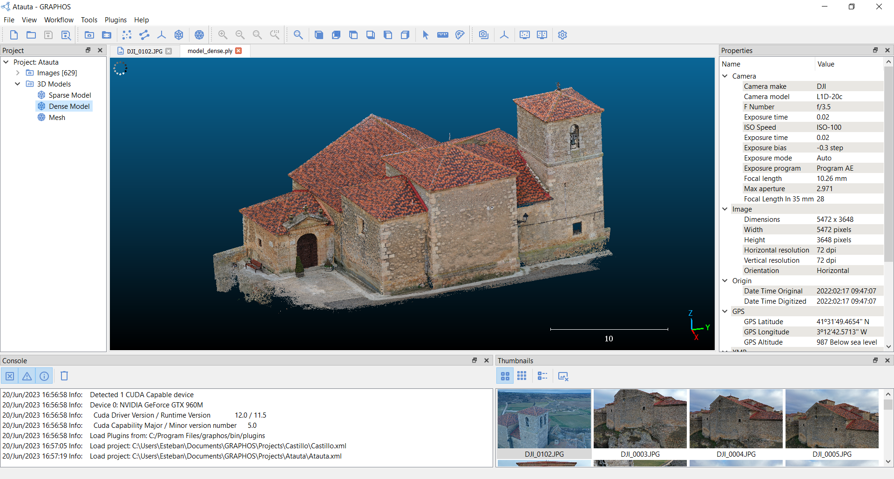

Open-source photogrammetric software for 3D reconstruction.

Build the Docker Image:

docker build -t graphos .

Running a Container with GPU Support:

docker run --gpus all --name GRAPHOS -it graphos
docker run -it --name GRAPHOS -v /home/user/data:/app graphos